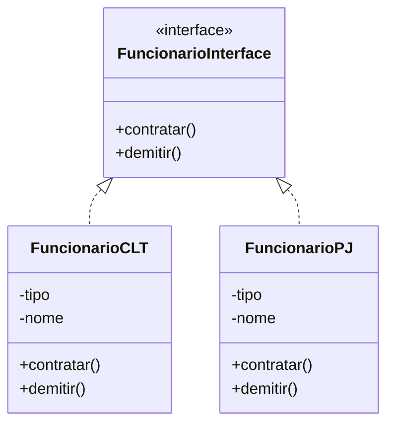

# Diagrama de Classes - Funcionários

```mermaid
classDiagram
FuncionarioInterface <|.. FuncionarioCLT
FuncionarioInterface <|.. FuncionarioPJ

    class FuncionarioInterface {
        <<interface>>
        +contratar()
        +demitir()
    }
    class FuncionarioCLT {
        -tipo
        -nome
        +contratar()
        +demitir()
    }
    class FuncionarioPJ {
        -tipo
        -nome
        +contratar()
        +demitir()
    }
```